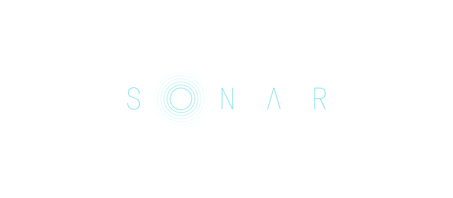
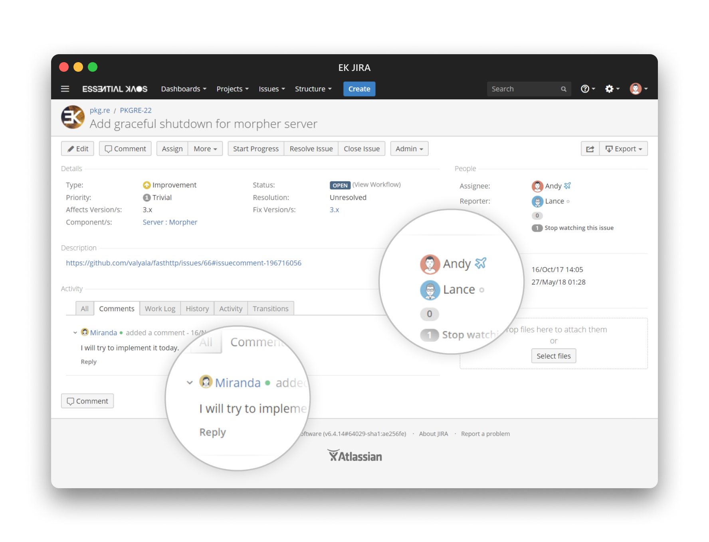

> [!IMPORTANT]  
> _This project is discounted. You can try to use it as is or fork it._

<p align="center"><a href="#readme"></a></p>

<p align="center"><a href="#installation">Installation</a> • <a href="#contributing">Contributing</a> • <a href="#license">License</a></p>

<br/>

`Sonar` is a utility for showing user Slack status in Atlassian Jira.

### Screenshots

<p align="center">
  
  <i>Sonar in Jira 6.x (with <a href="https://github.com/essentialkaos/atlassian-remixed-theme">Remixed Theme</a>)</i>
</p>

### Installation

#### From [ESSENTIAL KAOS Public Repository](https://kaos.sh/kaos-repo)

```bash
sudo yum install -y https://pkgs.kaos.st/kaos-repo-latest.el$(grep 'CPE_NAME' /etc/os-release | tr -d '"' | cut -d':' -f5).noarch.rpm
sudo yum install sonar
```

#### Slack app

Create [classic Slack App](https://api.slack.com/apps?new_classic_app=1) (_this application requires RTM and can't work with socket mode due to lack of presence events_).

Add next OAuth scopes to your app:

- `dnd:read`
- `users:read`

#### Integration with Jira

Go to `atlassian-jira/WEB-INF/classes/templates/plugins/userformat` and modify next files.

**actionProfileLink.vm**

```html
<a $!{userHoverAttributes} id="$!{id}" href="${baseurl}/secure/ViewProfile.jspa?name=${velocityhelper.urlencode($username)}">${renderedAvatarImg} ${author}</a>
```

**profileLinkWithAvatar.vm**

```html
${textutils.htmlEncode($fullname)}
```

**avatarFullNameHover.vm**

```html
$textutils.htmlEncode($fullname)

```

Then restart your Jira instance.

Also, you can add `sonar.js` to your announcement banner for a periodic status update.

### Contributing

Before contributing to this project please read our [Contributing Guidelines](https://github.com/essentialkaos/contributing-guidelines#contributing-guidelines).

### License

[Apache License, Version 2.0](https://www.apache.org/licenses/LICENSE-2.0)

<p align="center"><a href="https://essentialkaos.com"></a></p>
